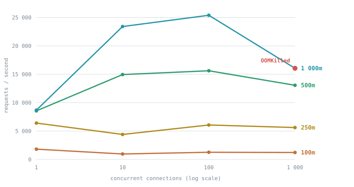
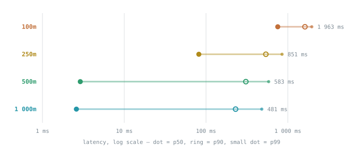

# Capacity report

How many concurrent connections one pod absorbs, and what each CPU and memory limit actually
costs. Every figure here is measured on a real cluster — none estimated.

Reproduce any of it with [`tools/cmd/helm-capacity`](../tools/cmd/helm-capacity/main.go) (both
limits set) or [`tools/cmd/helm-loadtest`](../tools/cmd/helm-loadtest/main.go) (memory limit only).
[`capacity-report.html`](capacity-report.html) is the same report as an interactive page —
open it straight from disk; GitHub won't render it in the repository view, which is why this
Markdown version exists.

Numbers use a space as the thousands separator, never the US comma.

| | |
|---|---|
| Cluster | kind v1.37, single node, 4 vCPU |
| Replicas | 1 — every figure is per pod |
| Driver | fortio, in-cluster, `-httpbufferkb 1024` |
| Resource | the app's JS bundle, 421 490 bytes |
| Run | 20 s at max rate per data point |

## A connection is not a request

Everything below depends on this. **1 000 connections does not mean 1 000 req/s.** A keepalive
connection carries thousands of sequential requests — it stays open and keeps going.
Connections say how many conversations are open at once; req/s says how fast the words move.
Measured directly in one run:

```text
Sockets used: 4 (for perfect keepalive, would be 4)
Code 200 : 305 370 (100.0 %)
```

Four connections, 305 370 requests. At 1 000 connections and 16 051 req/s, each connection
receives about 16 req/s — one request every ~62 ms.

A concurrent *user* is different again: a browser opens around six connections per host, a
cold page load is about four requests, and a reader spends most of their time not fetching
anything. 1 000 held-open connections is far more traffic than 1 000 people on the site.

## Throughput by concurrency and CPU limit

Memory fixed at 128 Mi.



| CPU limit | 1 connection | 10 connections | 100 connections | 1 000 connections |
|---|---|---|---|---|
| 100m | 1 814 req/s | 961 req/s | 1 269 req/s | 1 221 req/s |
| 250m | 6 404 req/s | 4 405 req/s | 6 066 req/s | 5 613 req/s |
| 500m | 8 552 req/s | 14 946 req/s | 15 619 req/s | 13 057 req/s |
| 1 000m | 8 688 req/s | 23 409 req/s | 25 393 req/s | **16 051 req/s — OOMKilled** |

Two readings matter more than the numbers:

**One connection cannot use more than about 500m.** Throughput at a single connection
plateaus around 8 600 req/s however much CPU you grant (8 552 at 500m, 8 688 at 1 000m),
because a connection waits for each response before sending the next. Concurrency is what
converts CPU into throughput, so a capacity figure quoted without a concurrency figure beside
it means very little.

**At 100m the curve is not even monotonic** — 1 814 req/s at one connection, 961 at ten. Under
a tight quota, extra concurrency costs more in throttling and context-switching than it
returns.

## Latency at 1 000 connections



| CPU limit | p50 | p90 | p99 |
|---|---|---|---|
| 100m | 753.9 ms | 1 621.2 ms | 1 962.8 ms |
| 250m | 81.7 ms | 539.1 ms | 850.6 ms |
| 500m | 2.9 ms | 307.0 ms | 582.9 ms |
| 1 000m | 2.6 ms | 229.8 ms | 480.6 ms |

The median is already excellent at 500m — 2.9 ms against 2.6 ms at 1 000m. The whole
difference between those two is in the tail, and at this concurrency the tail is dominated by
queuing rather than by CPU.

## Memory is not a dial, it is a cliff

CPU is a dial: below what it needs, the service slows down but serves every request. Memory is
not: below what it needs, the kernel kills the container mid-response. At rest the pod fits in
5 Mi, which makes a small limit look entirely safe — and that is the trap.

| Limit | Concurrency | Throughput | Result |
|---|---|---|---|
| 32Mi | 100 | 2 805 req/s | ✕ OOMKilled ×2, 46 995 requests lost |
| 64Mi | 100 | 18 541 req/s | ✓ measured floor, zero errors |
| 128Mi | 100 | 19 431 req/s | ✓ peak working set 36 Mi |
| 128Mi | 1 000 | 17 569 req/s | ✕ OOMKilled in 4 runs out of 5 |
| 256Mi | 1 000 | 16 589 req/s | ✓ stable, 3 runs out of 3 |
| 512Mi | 1 000 | 14 945 req/s | ✓ no gain over 256Mi |

Peak observed working set is 36 Mi at 100 connections. The transient buffer demand of
streaming a large file to many connections at once is what no steady-state reading shows you.

**More CPU makes memory worse.** The only OOMKill in the whole campaign came at the *highest*
CPU limit. A faster pod holds more responses in flight and each one costs buffers: at 1 000
connections, 500m never died at 128 Mi while 1 000m died four times out of five. CPU and
memory limits are not independent dials, which is the opposite of how they are usually set.

## Sizing by target concurrency

The cheapest limits that don't cost you latency, per level. Requests stay at `cpu: 10m` /
`memory: 32Mi` throughout — those are what the cluster actually reserves, and the pod idles
near zero.

| Connections | `limits.cpu` | `limits.memory` | Throughput | p99 | Why this pair |
|---|---|---|---|---|---|
| 1 | 250m | 64Mi | 6 404 req/s | 1.0 ms | More CPU changes nothing: one connection plateaus at ~8 600 req/s. 100m would cost 11× the p99 (11.3 ms). |
| 10 | 500m | 64Mi | 14 946 req/s | 4.2 ms | Dropping to 250m costs 3.4× the throughput and 18× the p99 (76.7 ms). |
| 100 | 500m | 128Mi | 15 619 req/s | 55.8 ms | 64Mi is the measured floor and peak working set is 36 Mi, so 128Mi is the first comfortable step. |
| 1 000 | 500m | 256Mi | 13 057 req/s | 582.9 ms | 128Mi was OOMKilled in 4 runs of 5 here, and 1 000m is the limit that triggers it. |

Two things this table is not saying:

- **The memory column is a floor plus margin, not a target.** 64Mi is measured clean at 100
  connections, which bounds everything below it; only the 1 000-connection row was measured
  separately, because that is where 128Mi fails.
- **500m is the right CPU for almost everything.** It appears in three rows out of four. Below
  it the tail degrades sharply; above it, throughput per millicore falls off a cliff — 500m to
  1 000m buys 23% at 1 000 connections, and is the only setting that got OOMKilled.

## The balance point

For a platform that mandates both limits, at high concurrency:

```yaml
resources:
  requests:
    cpu: 10m          # what the cluster actually reserves
    memory: 32Mi
  limits:
    cpu: 500m         # ~13 000 req/s at 1 000 connections
    memory: 256Mi     # 128Mi dies at this concurrency
```

That is what [`ci/both-limits-values.yaml`](../charts/yaml-config-generator-validator/ci/both-limits-values.yaml)
carries, and CI renders it on every push.

- Doubling CPU from 500m to 1 000m buys only **+23%** throughput (13 057 → 16 051 req/s).
  That is the worst-value step on the curve; below it, 250m → 500m more than doubles
  throughput for the same doubling of CPU.
- 500m never triggered an OOM, even at 128 Mi.
- 256Mi rather than 128Mi is confirmed rather than assumed: 128Mi was killed in 4 runs out of
  5, 256Mi held 3 out of 3. Unused memory costs nothing at runtime — only the *request*
  reserves capacity, and that stays at 32Mi.

If cost matters more than latency, **250m / 256Mi** still serves 5 613 req/s at 1 000
connections with zero errors — at ~4 requests per cold page load, roughly 1 400 page loads a
second.

## Before you quote any of this

1. **The load generator shares the node.** fortio runs in the same 4-vCPU cluster, so absolute
   throughput is a floor rather than a capacity rating. The shape of the curves and where
   things break is what transfers.
2. **One replica.** Every figure is per pod; the chart deploys two by default.
3. **Cold load.** Every request fetches the full bundle. A real browser caches it and
   afterwards asks only for `index.html`, so capacity in real users is far higher.
4. **nginx forks one worker per *node* CPU**, not per CPU limit — 4 here, 64 on a 64-core
   node. The base image's autotune script cannot fix that under `readOnlyRootFilesystem`,
   which forbids it from rewriting `nginx.conf`.
